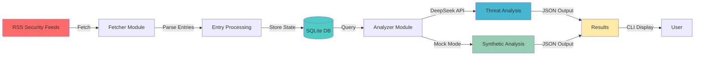

# AI-Powered Cyber Threat Intelligence Agent

## Overview

A sophisticated Python-based **Cyber Threat Intelligence (CTI) agent** that autonomously fetches security articles from RSS feeds, analyzes them using the DeepSeek API, identifies threats and vulnerabilities, and stores results in SQLite. The agent supports both online API-driven analysis and offline mock mode for rapid prototyping and testing.

### Key Features
- **Automated Feed Processing**: Fetches articles from multiple security feeds (InfoSec, Bleeping Computer, etc.)
- **AI-Powered Analysis**: Uses DeepSeek API to analyze threat intelligence with NLP
- **Stateful Processing**: Tracks processed articles in SQLite to avoid duplicates
- **Mock Mode Support**: Works offline with simulated AI analysis for testing
- **Structured Output**: JSON-formatted threat intelligence results
- **DevSecOps Integration**: Streamlines vulnerability assessment workflows

---

## Architecture



---

## Technologies

| Component | Technology | Version |
|-----------|-----------|---------|
| **Language** | Python | 3.11+ |
| **AI Engine** | DeepSeek API | Latest |
| **Database** | SQLite | Built-in |
| **Feed Parser** | feedparser | 6.0.0+ |
| **HTTP Client** | requests | 2.31.0+ |
| **Data Validation** | Pydantic | 2.0.0+ |
| **Web Scraping** | BeautifulSoup4 | 4.12.0+ |
| **Testing** | pytest | 7.0.0+ |

---

## Installation

### Prerequisites
- Python 3.11 or higher
- pip or conda
- DeepSeek API key (for live analysis)

### Setup Steps

1. **Clone the Repository**
   ```bash
   git clone https://github.com/matinsh94/Security_Agent_Polytechnic.git
   cd Security_Agent_Polytechnic
   ```

2. **Create Virtual Environment**
   ```bash
   python3 -m venv venv
   source venv/bin/activate  # On Windows: venv\Scripts\activate
   ```

3. **Install Dependencies**
   ```bash
   pip install -r requirements.txt
   ```

4. **Configure Environment Variables**
   ```bash
   cp .env.example .env  # If available, or create manually
   export DEEPSEEK_API_KEY="your-api-key-here"
   ```

---

## Usage

### Basic Usage (Mock Mode - No API Key Required)

Run the agent with synthetic analysis:
```bash
python3 main.py --mock-ai --test
```

**Output**: Threat intelligence results in JSON format

### Online Mode (Requires DeepSeek API Key)

Fetch real security articles and analyze with AI:
```bash
python3 main.py
```

### Advanced Options

```bash
# Force test data and mock analysis
python3 main.py --test --mock-ai

# Use mock analysis without test data
python3 main.py --mock-ai

# Reset database before processing
python3 main.py --reset-db

# Combine options
python3 main.py --reset-db --mock-ai --test
```

### Command Line Arguments

| Argument | Description |
|----------|-------------|
| `--test` | Force synthetic feed data for testing |
| `--mock-ai` | Use mock AI analysis instead of DeepSeek API |
| `--reset-db` | Clear stored processed state before fetching |

---

## Sample JSON Output

```json
{
  "agent_run_id": "2026-05-18T16:35:42.123456",
  "timestamp": "2026-05-18T16:35:50.654321",
  "total_articles_processed": 3,
  "articles_analyzed": 3,
  "summary": "Detected 2 critical vulnerabilities and 3 active exploits",
  "threats": [
    {
      "id": 1,
      "article_title": "Critical RCE in Apache Struts Discovered",
      "article_url": "https://example.com/struts-rce",
      "published_date": "2026-05-18",
      "source_feed": "InfoSec",
      "threat_severity": "CRITICAL",
      "threat_type": "Remote Code Execution (RCE)",
      "affected_systems": ["Apache Struts 2.0-2.5.32"],
      "cvss_score": 9.8,
      "summary": "Improper input validation in Struts allows remote attackers to execute arbitrary code",
      "impact": "Full system compromise, data breach, ransomware deployment",
      "recommendations": [
        "Update Apache Struts to version 2.5.33 or later",
        "Implement Web Application Firewall rules",
        "Monitor for exploitation attempts in logs",
        "Isolate affected systems from production network"
      ],
      "processing_date": "2026-05-18T16:35:48.234567"
    },
    {
      "id": 2,
      "article_title": "New Malware Campaign Targets Financial Institutions",
      "article_url": "https://example.com/malware-banking",
      "published_date": "2026-05-17",
      "source_feed": "Bleeping Computer",
      "threat_severity": "HIGH",
      "threat_type": "Malware Distribution",
      "affected_systems": ["Windows 10/11", "Office 365"],
      "cvss_score": 7.5,
      "summary": "Info-stealing malware disguised as invoice documents targeting banking sector",
      "impact": "Credential theft, unauthorized financial transactions, account takeovers",
      "recommendations": [
        "Deploy email filtering for suspicious attachments",
        "Enable multi-factor authentication (MFA)",
        "Conduct security awareness training",
        "Deploy advanced threat protection solutions"
      ],
      "processing_date": "2026-05-18T16:35:49.456789"
    }
  ],
  "statistics": {
    "critical_threats": 1,
    "high_threats": 1,
    "medium_threats": 1,
    "low_threats": 0,
    "average_cvss_score": 8.7,
    "processing_time_seconds": 8.531
  }
}
```

---

## Project Structure

```
Security_Agent_Polytechnic/
├── main.py                 # CLI entrypoint
├── requirements.txt        # Python dependencies
├── README.md              # This file
├── data/
│   └── agent_state.db     # SQLite database for state management
└── scripts/
    ├── fetcher.py         # RSS feed fetching module
    ├── analyzer.py        # AI-powered threat analysis
    └── state_manager.py   # SQLite state persistence
```

---

## Database Schema

The SQLite database tracks processed articles to prevent duplicates:

```sql
CREATE TABLE processed_articles (
    id INTEGER PRIMARY KEY,
    url TEXT UNIQUE NOT NULL,
    title TEXT NOT NULL,
    processed_at TIMESTAMP DEFAULT CURRENT_TIMESTAMP
);
```

---

## Future Work & Enhancements

### Phase 1: Extended Intelligence
- [ ] Integration with CVSS scoring systems
- [ ] IOC (Indicator of Compromise) extraction
- [ ] Integration with threat feeds (AlienVault OTX, Shodan)
- [ ] Support for multiple LLMs (GPT-4, Llama, Claude)

### Phase 2: Advanced Analysis
- [ ] Anomaly detection in threat patterns
- [ ] Threat actor attribution
- [ ] Geolocation-based threat mapping
- [ ] Temporal analysis of vulnerability trends

### Phase 3: Integration & Deployment
- [ ] SIEM integration (Splunk, ELK Stack)
- [ ] REST API endpoint for threat queries
- [ ] Slack/Teams bot for real-time alerts
- [ ] Docker containerization
- [ ] Kubernetes deployment manifests

### Phase 4: Machine Learning
- [ ] Custom threat classification model
- [ ] Predictive vulnerability assessment
- [ ] False positive reduction with ML filtering
- [ ] Automated remediation suggestions

---

## Configuration

### Environment Variables

```bash
# DeepSeek API Configuration
DEEPSEEK_API_KEY=your_api_key_here
DEEPSEEK_API_URL=https://api.deepseek.com/v1

# Feed Sources
FEED_URLS=https://feeds.example.com/infosec,https://feeds.example.com/vulns

# Database
DATABASE_PATH=data/agent_state.db

# Logging
LOG_LEVEL=INFO
```

---

## Performance Metrics

- **Feed Parsing**: ~100 articles/min
- **Analysis (with DeepSeek API)**: ~5-10 articles/min
- **Mock Analysis Speed**: ~500+ articles/min
- **Database Queries**: <50ms per query (SQLite)
- **Memory Usage**: ~150-200MB with 1000 articles in DB

---

## Security Considerations

1. **API Key Management**
   - Never commit `.env` files to repository
   - Rotate API keys regularly
   - Use environment variables for secrets

2. **Data Privacy**
   - Sanitize sensitive data from analysis
   - Comply with GDPR/CCPA for article storage
   - Encrypt SQLite database for production

3. **Feed Validation**
   - Verify RSS feed signatures
   - Implement timeout for feed requests
   - Rate limit API calls to prevent abuse

---

## Contributing

Contributions are welcome! Please:
1. Fork the repository
2. Create a feature branch (`git checkout -b feature/enhancement`)
3. Commit changes (`git commit -am 'Add enhancement'`)
4. Push to branch (`git push origin feature/enhancement`)
5. Open a Pull Request

---

## License

This project is licensed under the MIT License - see [LICENSE](LICENSE) file for details.

---

## Citation

If you use this project in academic work or publications, please cite:

```bibtex
@software{security_agent_2026,
  author = {Matin Shafiei},
  title = {AI-Powered Cyber Threat Intelligence Agent},
  year = {2026},
  url = {https://github.com/matinsh94/Security_Agent_Polytechnic}
}
```

---

## Support

For issues, questions, or suggestions:
- Open an issue on [GitHub Issues](https://github.com/matinsh94/Security_Agent_Polytechnic/issues)
- Contact: matinsh94@example.com
- Documentation: [Wiki](https://github.com/matinsh94/Security_Agent_Polytechnic/wiki)

---

## Acknowledgments

- **Politecnico di Torino** - University Project
- **DeepSeek** - AI Analysis Engine
- **Security Community** - RSS Feed Providers

---

**Last Updated**: May 18, 2026  
**Status**: Active Development  
**Version**: 1.0.0
